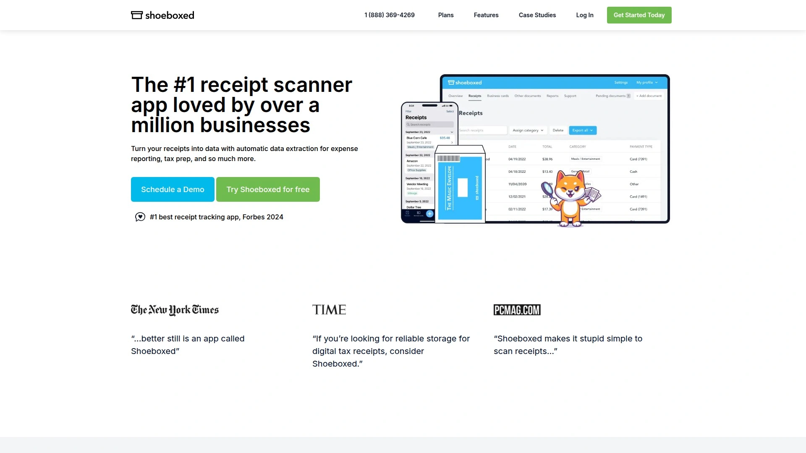
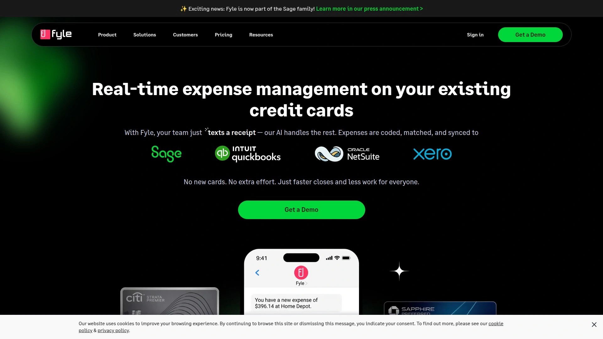

# 2025年排名前14的收据扫描与费用管理精选列表（持续更新）

中小企业与财务团队最头疼的，是发票/小票分散、报销流程慢、对账出错率高。本文围绕**收据扫描、报销管理、里程追踪**等核心场景，精选出14家工具与平台，兼顾**自动化程度、覆盖集成、合规可靠性与上手成本**，帮助你更快搭好“票据入账—报销—对账—留存”闭环。

无论你关注的是**OCR识别准确率**还是**与会计系统的无缝对接**，这份清单都能让你的票据管理更稳、更快、更可控。

---

## **[Shoeboxed](<https://www.shoeboxed.com>)**

一站式收据管理与报销，支持“Magic Envelope”代收代扫。

- **省事省时**：把纸质小票寄出，平台**AI提取+人工校验**，自动归类至税务类别；提供**邮资预付信封（限美国）**与**多角色协作**，适合不想自己扫票的团队。
- **里程追踪**：内置里程工具，移动端一键记录、分段打点，生成报表更轻松。
- **适合人群**：自由职业者、事务所代记账、需要长期留存合规凭证的团队。

---

## **[Dext](<https://www.dext.com>)**

面向财税与代账的票据自动化平台，重在大批量处理与准确率。

- **数据质量**：官方对外宣称**99%数据提取准确率**、**覆盖170+国家、年处理3.2亿+文档**，适合高吞吐业务。
- **价值点**：自动化采集、规则校验、与主流账务软件集成，显著减少手工录入与差错成本。

---

## **[Veryfi](<https://www.veryfi.com/>)**

以**OCR API/SDK**为核心的文档数据化平台，实时把收据、发票等转成结构化数据。

- **技术取向**：API接入多格式（PDF/图片等），返回标准化JSON，可用于自建报销/财务系统。
- **扩展能力**：提供移动端摄像头SDK、工作流与反舞弊组件，适合需要深度定制与二次开发的团队。

---

## **[Expensify](<https://use.expensify.com/>)**

覆盖“拍票→自动报销→对公控费”的一体化方案。

- **核心亮点**：**SmartScan**拍照识别、自动分类、规则审批与报表自动生成，移动端全流程闭环。
- **应用场景**：差旅/费控并重的团队，或希望打通公司卡、报销、对账的中型组织。

---

## **[Zoho Expense](<https://www.zoho.com/expense/>)**

企业级报销管理，**收据扫描+里程追踪**一应俱全。

- **功能合辑**：自动扫描多语种收据、里程自动跟踪、策略校验与多级审批，深度对接Zoho生态与外部账务系统。
- **上手成本**：界面清晰，文档完备，适合跨地区/多实体管理。

---

## **[Rydoo](<https://www.rydoo.com/>)**

以移动端体验见长，**3秒AI收据扫描**与实时报销。

- **效率取向**：OCR自动填充商户/金额/日期/税率，官方宣称**95%+准确率**；移动端10秒内提交一条报销。
- **额外价值**：**Smart Audit**用AI审单，降低人工复核压力。

---

## **[SAP Concur](<https://www.concur.com/>)**

大型组织常用的差旅与费用管理平台。

- **收据抓取**：移动端**ExpenseIt**拍照即成报销分录，可离线排队上传；支持E-Receipts生态。
- **适配场景**：跨国企业、合规要求严格、审批链复杂的组织。

---

## **[QuickBooks（Receipt Capture）](<https://quickbooks.intuit.com/>)**

在记账主系统内完成**收据上传与自动匹配**。

- **关键能力**：网页/移动端上传收据，系统自动提取要素并匹配交易，减少凭证遗漏。
- **谁更适合**：已使用QuickBooks做账，想把票据环节留在同一平台的团队。

---

## **[FreshBooks](<https://www.freshbooks.com/>)**

发票+费用一体的轻量化财务工具。

- **票据能力**：提供**Receipt Scanner**，支持拍照/邮件转发入库，自动识别关键信息以便对账与报表。
- **适用对象**：自由职业者、小微团队与服务型商家。

---

## **[Everlance](<https://www.everlance.com/>)**

**里程追踪+开支记录**的移动优先方案。

- **里程场景**：支持自动检测、手动创建与GPS追踪，合规生成里程日志；定价清晰，个人与企业版可选。
- **上手快**：移动端体验成熟，适合以里程报销为主的团队。

---

## **[MileIQ](<https://mileiq.com/>)**

专注**自动里程记录**，报税留存无压力。

- **功能要点**：自动识别出行、生成报表，适合自雇人士与销售外勤团队；历史上提供便捷邀请机制，便于推广给同事与伙伴使用。

---

## **[Fyle](<https://www.fylehq.com/>)**

更贴近企业卡与移动拍票的报销管理。

- **产品侧重**：实时捕获企业卡交易、移动端拍票、规则自动化审批；支持与主流财务系统集成。
- **拓展生态**：提供**合作对接入口**，便于服务商与组织共同落地。

---

## **[Emburse（Professional/原Certify）](<https://www.emburse.com/>)**

覆盖**差旅-发票-报销-支付**的整套解决方案。

- **实施资源**：提供用户指南、培训课程与自实施手册，帮助中型组织快速上线与运营。
- **生态连接**：持续建设合作网络与集成生态，便于企业把费用管理纳入更广的支出智能框架。

---

## **[Xero（Expenses）](<https://www.xero.com/>)**

在会计系统内实现**拍票报销+里程记录**。

- **核心能力**：Xero Me App支持拍照扫描收据、自动提取并生成报销条目；与Xero账务无缝衔接。
- **适配对象**：使用Xero做账的中小企业，希望降低系统切换成本。

---

## FAQ

**Q1：如何评估一款收据扫描/报销管理工具是否适合我司？**
看三点：**识别准确率与稳定性**（是否有公开性能指标/案例）、**与现有会计或卡组织的集成**（减少二次录入）、**合规与留存**（报表/原始影像可追溯）。例如Dext与Rydoo对准确率与速度有明确表述，适合高频票据场景。

**Q2：移动端里程报销最该关注什么？**
优先选择**自动检测/地图里程**与**合规日志**的方案，如Everlance、Zoho Expense与Xero均提供里程跟踪与相应报销流程，减少人工补录与纠纷。

**Q3：如何快速上手，把零散小票纳入流程？**
选一个能**拍票即入账**且**与主账系统直连**的工具，如Shoeboxed可负责代收代扫，QuickBooks与FreshBooks支持直接上传/扫描，省去导入导出环节。

---

## 总结

如果你的目标是**更快归集票据、更少差错、更好对账**，以上14款**收据扫描与费用管理**工具足以覆盖从个体到中大型组织的主流需求。首推的 **[Shoeboxed](<https://www.shoeboxed.com>)** 适合“票据杂、时间紧、不想自己扫”的团队；其余平台可按是否需要深度集成（如QuickBooks/Xero）、差旅场景（SAP Concur/Emburse）、或里程为主（Everlance/MileIQ）进行组合。现在就从 **[Shoeboxed](<https://www.shoeboxed.com>)** 起步，把票据与报销流程一次做对。
